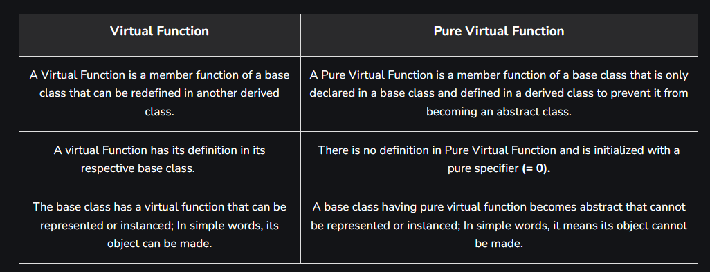

# C++ playground
C++ Code testing and learning

#  Table of contents
1. Namespace
2. 4 pillars 
3. Pointers & References 
4. Interview questions 


#  namespace
  - Quick conclusions

# 4 pillars 
## Encapsulation
In Object-Oriented Programming, Encapsulation is defined as binding together the data and the functions that manipulate them.


```c++
    // C++ program to demonstrate
    // Encapsulation
    #include <iostream>
    using namespace std;

    class Encapsulation {
    private:
        // Data hidden from outside world
        int x;

    public:
        // Function to set value of
        // variable x
        void set(int a) { x = a; }

        // Function to return value of
        // variable x
        int get() { return x; }
    };

    // Driver code
    int main()
    {
        Encapsulation obj;
        obj.set(5);
        cout << obj.get();
        return 0;
    }
```
## Abstraction
Abstraction means displaying only essential information and hiding the details. Data abstraction refers to providing only essential information about the data to the outside world, hiding the background details or implementation.
- Abstraction using Classes: We can implement Abstraction in C++ using classes. The class helps us to group data members and member functions using available access specifiers. A Class can decide which data member will be visible to the outside world and which is not.
- we simply call the function pow() present in the math.h header file and pass the numbers as arguments without knowing the underlying algorithm according to which the function is actually calculating the power of numbers.

## Polymorphism

In simple words, we can define polymorphism as the ability of a message to be displayed in more than one form.
- Operator Overloading: The process of making an operator exhibit different behaviors in different instances is known as operator overloading.
- Function Overloading: Function overloading is using a single function name to perform different types of tasks. Polymorphism is extensively used in implementing inheritance.

```c++
    // C++ program to demonstrate
    // Function overloading
    #include <iostream>
    using namespace std;

    class Class {
    private:
        // Data hidden from outside world
        int y;

    public:
        void function(int x)
        {
            cout << "Value of x is" << x << endl;
        }
        //same function but with double

        void function(double x)
        {
            cout << "Value of x is" << x << endl;
        }
        // Function with same name and
        // 2 int parameters
        void function(int x, int y)
        {
            cout << "value of x and y is " << x << ", " << y
                << endl;
        }

    };

    // Driver code
    int main()
    {
        Geeks obj1;

        // Function being called depends
        // on the parameters passed
        // function() is called with int value
        obj1.function(7);

        // function() is called with double value
        obj1.funfunctionc(9.132);

        // function() is called with 2 int values
        obj1.function(85, 64);
        return 0;
    }
```

```c++
// C++ program to demonstrate
// Operator Overloading or
// Compile-Time Polymorphism
#include <iostream>
using namespace std;

class Complex {
private:
    int real, imag;

public:
    Complex(int r = 0, int i = 0)
    {
        real = r;
        imag = i;
    }

    // This is automatically called
    // when '+' is used with between
    // two Complex objects
    Complex operator+(Complex const& obj)
    {
        Complex res;
        res.real = real + obj.real;
        res.imag = imag + obj.imag;
        return res;
    }
    void print() { cout << real << " + i" << imag << endl; }
};

// Driver code
int main()
{
    Complex c1(10, 5), c2(2, 4);

    // An example call to "operator+"
    Complex c3 = c1 + c2;
    c3.print();
}

```

```c++
// C++ Program to demonstrate
// the Virtual Function
#include <iostream>
using namespace std;

// Declaring a Base class
class GFG_Base {

public:
    // virtual function
    virtual void display()
    {
        cout << "Called virtual Base Class function"
             << "\n\n";
    }

    void print()
    {
        cout << "Called GFG_Base print function"
             << "\n\n";
    }
};

// Declaring a Child Class
class GFG_Child : public GFG_Base {

public:
    void display()
    {
        cout << "Called GFG_Child Display Function"
             << "\n\n";
    }

    void print()
    {
        cout << "Called GFG_Child print Function"
             << "\n\n";
    }
};

int main()
{
    // Create a reference of class GFG_Base
    GFG_Base* base;

    GFG_Child child;

    base = &child;

    // This will call the virtual function
    base->display();

    // This will call the non-virtual function
    base->print();
}
```

## Inheritance
The capability of a class to derive properties and characteristics from another class.
```c++
// C++ Program to Demonstrate the Concept of Dynamic binding
// with the help of virtual function

#include <iostream>
using namespace std;

class GFG
{
  public:
    // using "virtual" for the display function
    virtual void print()
    {
        cout << "Printing the Base class Content" << endl;
    }
    // function that calls print
    void call_Function()
    {
        print();
    }
};
// GFG2 inherits publicly from GFG
class GFG2 : public GFG
{
  public:
    // GFG2's display
    void print() override
    {
        cout << "Printing the Derived class Content" << endl;
    }
};

int main()
{
    // Creating GFG's object using pointer
    GFG *geeksforgeeks = new GFG();
    // Calling call_Function
    geeksforgeeks->call_Function();

    // creating GFG2 object using pointer
    GFG *geeksforgeeks2 = new GFG2();
    // calling call_Function for GFG2 object
    geeksforgeeks2->call_Function();

    delete geeksforgeeks;
    delete geeksforgeeks2;

    return 0;
}

```


# Pointers & References 
- Pointers: A pointer is a variable that holds the memory address of another variable. A pointer needs to be dereferenced with the * operator to access the memory location it points to. 

- References: A reference variable is an alias, that is, another name for an already existing variable. A reference, like a pointer, is also implemented by storing the address of an object. 
A reference can be thought of as a constant pointer (not to be confused with a pointer to a constant value!) with automatic indirection, i.e., the compiler will apply the * operator for you. 

usecase of reference

```c++
void increment(int &n) {
    n++;
}

int main() {
    int num = 10;
    increment(num);
    cout << "Incremented value: " << num << endl; // Output will be 11
    return 0;
}
```

# Pure Virtuak function

```c++
#include <iostream>
using namespace std;

class AbstractBase {
public:
    virtual void show() = 0; // Czysta funkcja wirtualna
};

class ConcreteDerived : public AbstractBase {
public:
    void show() override { // Implementacja czystej funkcji wirtualnej
        cout << "ConcreteDerived class show function." << endl;
    }
};

int main() {
    // AbstractBase ab; // Błąd: nie można instancjonować klasy abstrakcyjnej
    ConcreteDerived cd; // Możemy instancjonować klasę pochodną
    cd.show();         // Wywołanie funkcji show
    return 0;
}
```

# Private vs Protected 

# Interview questions 

# static in c and C++
237

There is a big difference between static functions in C and static member functions in C++. In C, a static function is not visible outside of its translation unit, which is the object file it is compiled into. In other words, making a function static limits its scope. You can think of a static function as being "private" to its *.c file (although that is not strictly correct).

In C++, "static" can also apply to member functions and data members of classes. A static data member is also called a "class variable", while a non-static data member is an "instance variable". This is Smalltalk terminology. This means that there is only one copy of a static data member shared by all objects of a class, while each object has its own copy of a non-static data member. So a static data member is essentially a global variable, that is a member of a class.

Non-static member functions can access all data members of the class: static and non-static. Static member functions can only operate on the static data members.

One way to think about this is that in C++ static data members and static member functions do not belong to any object, but to the entire class.